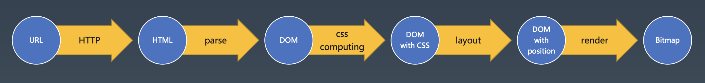
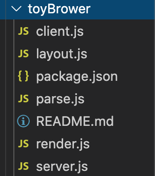
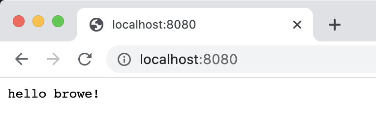
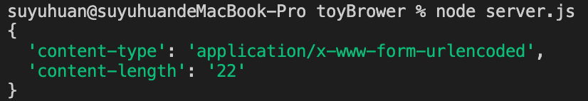
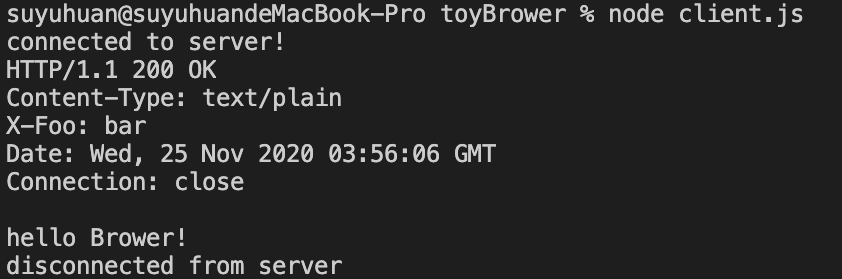
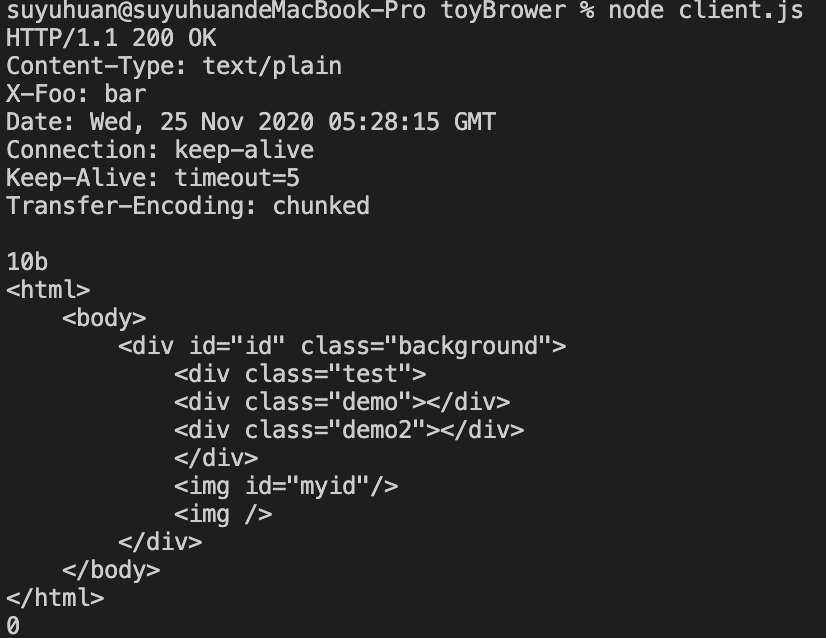
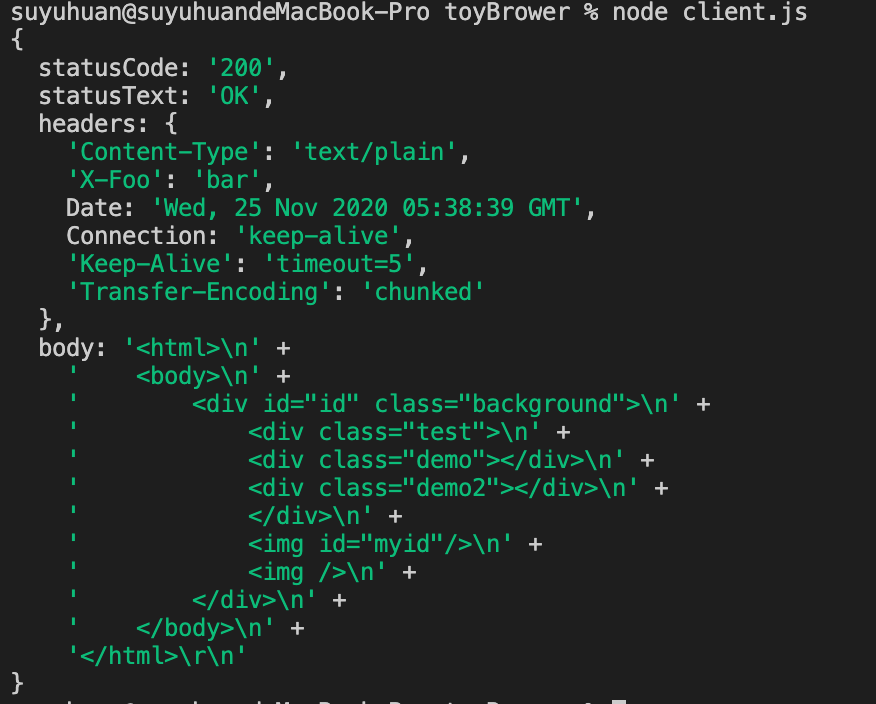
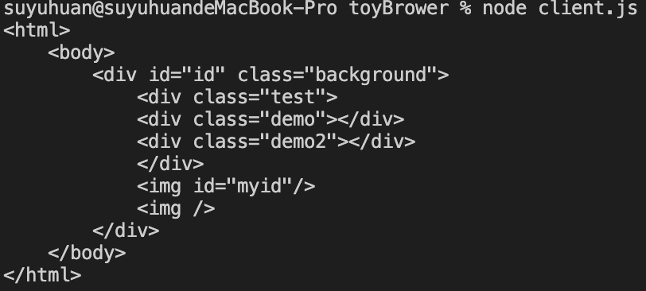

# toyBrower浏览器实战
toyBrower是学习浏览器核心原理的手写mini浏览器
>文章首发于公众号《玉丸子》，项目已经放到github：https://github.com/suyuhuan/toyBrower
>觉得可以的话，给个star鼓励下呗！
>有什么不对的或者建议或者疑惑，加wx:yuhuan_su一起探讨鸭！


# 浏览器原理基础
开始写代码之前我们必须要对url从浏览器发起请求到服务器返回经历了一些什么事情，有一个大概到认知。

不管你从哪里获取学习浏览器的基本原理的资料，总结从一个URL从浏览器到服务器，都是如下图所示经历的过程：

url--(http)->html--(parse)->dom--(css computing)->dom with css --(layout)-->dom with position--(render)-->bitmap



于是我们就从这几个方面一步一步的搭建出自己的浏览器。

# 项目架构分析
从基本原理入手，我们可以将我们的浏览器分解为6大块模块来进行部署开发，分别为：server、client、parser、css-computing、layout、render。

```
server模块：负责接受url发送数据的服务器端

client模块：负责发起url请求的浏览器端

parser模块：负责解析词法

css-computing模块：负责css解析

layout模块：负责构建布局

render模块：负责显示渲染
```

# 项目初始化
通过分析，我们把浏览器分解出了6大模块，通过6大模块来初始化我们的项目，如下所示：

第1步：新建toyBrower文件夹，在文件夹中npm init 初始化一个项目
```
npm init
```

第2步：在项目目录中分别新建如下文件：
```
server.js
client.js
parse.js
layout.js
render.js
```

这样子初始化项目完成。目录结构如下：



项目已经初始化好了，我们就开始写自己的浏览器吧！

# 建立浏览器与服务连接
开始自己动手写代码前，我已经默认你电脑具备了node.js的开发环境，没有的赶快装上，准备上车！

### 1.创建服务
在server.js中开启一个server服务，代码如下所示：

```js
// server.js
  const http = require("http");
  const server = http.createServer((req,res)=> {
    console.log(req.headers);
    res.setHeader('Content-Type','text/html');
    res.setHeader('X-Foo','bar');
    res.writeHead(200,{'Content-Type':'text/plain'});
    res.end(`hello Brower！`);
    })
    server.listen(8080);
```

在终端用node运行server.js，假如打开浏览器访问http://localhost:8080/，出现如下图所示：



这里我们已经开启了一个服务器，我们的目标是自己开发一个浏览器，而不是用现在的浏览器来打开。

所以接下来我们需要着手开发自己的浏览器端。

### 2.连接到服务
开发浏览器之前，我们要保证服务器和我们的浏览器能建立链接，在client.js中输入代码如下：

```js
// client.js
const net = require("net");

const client = net.createConnection({
  host:"127.0.0.1",
  port:8080},()=>{
console.log('connected to server!');

client.write(`POST /HTTP/1.1\r
Content-Type:application/x-www-form-urlencoded\r
Content-Length:22\r
\r
name=suyuhuan`);
});

client.on('data', (data)=> {
  console.log(data.toString());
  client.end();
});

client.on('end', ()=> {
  console.log('disconnected from server');
})
```
在server.js开启的情况下，运行client.js，控制台分别打印出请求-响应的信息，如下所示：





假如server和client中分别打印出了如上信息，说明服务器和浏览器端能进行通信了。这是做浏览器的第一步，同时也是最重要的一步。

### 3.浏览器获取服务端数据
在发起请求之前，我们在服务端server.js中，多添加一些有用的字符串，用于响应给浏览器，如下所示：

```js
//server.js
const http = require("http");
const server = http.createServer((req,res)=> {
    console.log(req.headers);
    res.setHeader('Content-Type','text/html');
    res.setHeader('X-Foo','bar');
    res.writeHead(200,{'Content-Type':'text/plain'});
    res.end(`<html>
    <body>
        <div id="id" class="background">
            <div class="test">
            <div class="demo"></div>
            <div class="demo2"></div>
            </div>
            
            
        </div>
    </body>
</html>`);
})
server.listen(8080);
```

### 创建Request类，封装浏览器向服务器发送的请求

在客户端client.js中把浏览器发起的请求作一个封装。包括设置请求头、请求体的默认值。
``` js
// client.js
const net = require("net");

class Request{

    constructor(options) {
        this.method = options.method || "GET";
        this.host = options.host;
        this.port = options.port || 80;
        this.path = options.path || "/";
        this.body = options.body || {};
        this.headers = options.headers || {};

        if (!this.headers["Content-Type"]) {
            this.headers["Content-Type"] = "application/x-www-form-urlencoded";
        }

        if (this.headers["Content-Type"] === "application/json") {
            this.bodyText  = JSON.stringify(this.body);
        } else if (this.headers["Content-Type"].includes('application/x-www-form-urlencoded')) {
            this.bodyText = Object.keys(this.body).map(key => `${key} = ${encodeURIComponent(this.body[key])}`).join('&');
        }

        this.headers["Content-Length"] = this.bodyText.length;
    }

    toString() {
        return `${this.method} ${this.path} HTTP/1.1\r
${Object.keys(this.headers).map(key => `${key} : ${this.headers[key]}`).join('\r\n')}\r
\r
${this.bodyText}`;
   }

    send(connection) {
        return new Promise((resolve,reject) => {
            if (connection) {
                connection.write(this.toString());
            } else {
                connection = net.createConnection({
                    host: this.host,
                    port: this.port
                }, ()=> {
                    connection.write(this.toString());
                })
            }

            connection.on('data',(data) => {
                resolve(data.toString())
                connection.end();
            });

            connection.on('error', (err)=> {
                reject(err);
                connection.end();
            })
        })
    }

}

// 向服务器发起请求
void async function() {
    let request = new Request({
        method: "POST",
        host: "127.0.0.1",
        port: "8080",
        path: "/",
        headers: {
         ['Content-Type']: 'application/x-www-form-urlencoded',
         ["X-Foo2"] : "customed"
        },
        body: {
          name:"suyuhuan"
        }
     })
     // 接受在服务端响应回来的信息
     let response = await request.send();
     console.log(response);
}();
```
重新运行client.js，打印出response的信息如下：



浏览器得到服务器响应的数据以后，就要对数据进行处理。浏览器进行的第一步就是数据分包。

# 浏览器进行数据拆包
浏览器会从服务器响应中拿到，状态行，响应头，响应体等数据。请求回来的数据后进行分包处理，然后进行词法分析。

所以我们就针对请求回来的数据，作如下几个部分的拆封，分别为：
statusCode、statusText、headers、body。

### 1.设计拆包预期
拆包预期如下：

``` js
{
  statusCode: '200',
  statusText: 'OK',
  headers: {
    'Content-Type': 'text/plain',
    'X-Foo': 'bar',
    Date: 'Wed, 25 Nov 2020 06:08:07 GMT',
    Connection: 'keep-alive',
    'Keep-Alive': 'timeout=5',
    'Transfer-Encoding': 'chunked'
  },
  body: '<html>\n' +
    '    <body>\n' +
    '        <div id="id" class="background">\n' +
    '            <div class="test">\n' +
    '            <div class="demo"></div>\n' +
    '            <div class="demo2"></div>\n' +
    '            </div>\n' +
    '            \n' +
    '            \n' +
    '        </div>\n' +
    '    </body>\n' +
    '</html>\r\n'
}
```

### 2.分析分词状态
要完成如上预期，首先我们需要对请求回来的数据进行词法分析，并且我们需要分别对数据设计几种状态，分别如下：
```js
    //状态行
    WAITING_STATUS_LINE = 0;

    //状态行结束
    WAITING_STATUS_LINE_END = 1;

    //header头名称
    WAITING_HEADER_NAME = 2;

    //header头空白
    WAITING_HEADER_SPACE = 3;

    //header头的值
    WAITING_HEADER_VALUE = 4;

    //header行结束
    WAITING_HEADER_LINE_END = 5;

    //header块结束
    WAITING_HEADER_BLOCK_END = 6;

    //body体
    WAITING_BODY = 7;
```

于是对每个状态收集过来的词，我们进行分包、打包处理。

### 3.进行分词分包处理
在client.js中，创建一个responseParser类，用来进行分包处理。如下：
```js
// client.js
const net = require("net");

class Request{

    constructor(options) {
        ....
    }

    toString() {
      ...
   }

    send(connection) {
        return new Promise((resolve,reject) => {

            const parser = new ResponseParser();//新添加代码

            if (connection) {
                connection.write(this.toString());
            } else {
                connection = net.createConnection({
                    host: this.host,
                    port: this.port
                }, ()=> {
                    connection.write(this.toString());
                })
            }

            connection.on('data',(data) => {

                // 把服务器响应回来的数据喂给分词工具
                parser.receive(data.toString());//新添加代码

                // resolve(data.toString())
                connection.end();
            });

            connection.on('error', (err)=> {
                reject(err);
                connection.end();
            })
        })
    }

}
//词法分析数据包
class ResponseParser{
    constructor() {
        //设置状态
        this.WAITING_STATUS_LINE = 0;
        this.WAITING_STATUS_LINE_END = 1;

        this.WAITING_HEADER_NAME = 2;
        this.WAITING_HEADER_SPACE = 3;
        this.WAITING_HEADER_VALUE = 4;
        this.WAITING_HEADER_LINE_END = 5;
        this.WAITING_HEADER_BLOCK_END = 6;
        
        this.WAITING_BODY = 7;

        // 初始状态
        this.current = this.WAITING_STATUS_LINE;

        //存储分包数据
        this.statusLine = '';
        this.headers = {};
        this.headerName = '';
        this.headerValue = '';
        this.bodyParser = '';
    }
    
    receive(string) {
        for (let i = 0; i < string.length; i++) {
            // 逐字分析
            this.receiveChar(string.charAt(i));
        }
    }
    // 词法分析
    receiveChar(char) {

        if (this.current === this.WAITING_STATUS_LINE) {
            if (char === '\r') {
              this.current = this.WAITING_STATUS_LINE_END;
            }else if (char === '\n') {
                this.current = this.WAITING_HEADER_NAME;
            } else {
              this.statusLine += (char);
            }
        }
        else if (this.current === this.WAITING_STATUS_LINE_END){
            if (char === '\n') {
                this.current = this.WAITING_HEADER_NAME;
            }
        }

        else if (this.current === this.WAITING_HEADER_NAME) {

          if (char === ':') {
              this.current = this.WAITING_HEADER_SPACE;
          } else if (char === "\r") {
              this.current = this.WAITING_HEADER_BLOCK_END;
              if (this.headers['Transfer-Encoding'] === 'chunked') {

                  // 对拆分出来的body数据继续进行处理
                  this.bodyParser = new TrunkedBodyParser();
              }
          } else {
              this.headerName += (char);
          }
        }

        else if (this.current === this.WAITING_HEADER_SPACE) {
            if (char === ' ') {
                this.current = this.WAITING_HEADER_VALUE;
            }
        }

        else if (this.current === this.WAITING_HEADER_VALUE) {
            if (char === '\r') {
                this.current = this.WAITING_HEADER_LINE_END;
                this.headers[this.headerName] = this.headerValue;
                this.headerName = "";
                this.headerValue = "";
            } else {
                this.headerValue += (char);
            }
        }
        
        else if (this.current === this.WAITING_HEADER_LINE_END) {
            if (char === '\n') {
                this.current = this.WAITING_HEADER_NAME;
            }
        }
        else if (this.current === this.WAITING_HEADER_BLOCK_END) {
            if (char === '\n') {
                this.current = this.WAITING_BODY;
            }
        }

        else if (this.current === this.WAITING_BODY) {
            this.bodyParser.receiveChar(char)
        }

    }
}
// 分析body数据
class TrunkedBodyParser{
    constructor() {

        //分析body体状态
        this.WAITING_LENGTH = 0;
        this.WAITING_LENGTH_LINE_END =1;
        this.READING_TRUNK = 2;
        this.WAITING_NEW_LINE = 3;
        this.WAITING_NEW_LINE_END = 4;

        this.length = 0;
        this.content = [];
        this.isFinished = false;

        //初始状态
        this.current = this.WAITING_LENGTH;

    }
    // 词法分析
    receiveChar(char) {
        if (this.current === this.WAITING_LENGTH) {
            if (char === '\r') {
                if (this.length === 0) {
                    this.isFinished = true;
                }
                this.current = this.WAITING_LENGTH_LINE_END;
            } else {
                this.length *= 16;
                this.length += parseInt(char, 16);
            }
        }
        else if (this.current === this.WAITING_LENGTH_LINE_END) {
            if (char === '\n') {
                this.current = this.READING_TRUNK;
            }
        }
        else if (this.current === this.READING_TRUNK) {
            this.content.push(char);
            this.length --;
            if (this.length === 0) {
                this.current = this.WAITING_NEW_LINE;
            }
        }
        else if (this.current === this.WAITING_NEW_LINE) {
            if (char === '\r') {
                this.current = this.WAITING_NEW_LINE_END;
            }
        }
        else if (this.current === this.WAITING_NEW_LINE_END) {
            if (char === '\n') {
                this.current = this.WAITING_LENGTH;
            }
        }
    }
}

void async function() {
    let request = new Request({
       ....
     })

     let response = await request.send();
     console.log(response);
}();
```

做到这一步，浏览器数据拆包的词法分析的工作基本完成。怎么确定拆出来的数据是正确的，这个时候我们需要把这些拆分出来的数据进行收集，返回出来。

### 4.收集分包数据返回
最终分包处理后的完整代码如下：
```js
//client.js
const net = require("net");

class Request{

    constructor(options) {
        this.method = options.method || "GET";
        this.host = options.host;
        this.port = options.port || 80;
        this.path = options.path || "/";
        this.body = options.body || {};
        this.headers = options.headers || {};

        if (!this.headers["Content-Type"]) {
            this.headers["Content-Type"] = "application/x-www-form-urlencoded";
        }

        if (this.headers["Content-Type"] === "application/json") {
            this.bodyText  = JSON.stringify(this.body);
        } else if (this.headers["Content-Type"].includes('application/x-www-form-urlencoded')) {
            this.bodyText = Object.keys(this.body).map(key => `${key} = ${encodeURIComponent(this.body[key])}`).join('&');
        }

        this.headers["Content-Length"] = this.bodyText.length;
    }

    toString() {
        return `${this.method} ${this.path} HTTP/1.1\r
${Object.keys(this.headers).map(key => `${key} : ${this.headers[key]}`).join('\r\n')}\r
\r
${this.bodyText}`;
   }

    send(connection) {
        return new Promise((resolve,reject) => {
            const parser = new ResponseParser();
            if (connection) {
                connection.write(this.toString());
            } else {
                connection = net.createConnection({
                    host: this.host,
                    port: this.port
                }, ()=> {
                    connection.write(this.toString());
                })
            }

            connection.on('data',(data) => {
                parser.receive(data.toString());
                
                if (parser.isFinished) {
                    resolve(parser.response);
                  }
                connection.end();
            });

            connection.on('error', (err)=> {
                reject(err);
                connection.end();
            })
        })
    }

}
//
class ResponseParser{
    constructor() {
        this.WAITING_STATUS_LINE = 0;
        this.WAITING_STATUS_LINE_END = 1;

        this.WAITING_HEADER_NAME = 2;
        this.WAITING_HEADER_SPACE = 3;

        this.WAITING_HEADER_VALUE = 4;

        this.WAITING_HEADER_LINE_END = 5;
        this.WAITING_HEADER_BLOCK_END = 6;

        this.WAITING_BODY = 7;

        this.current = this.WAITING_STATUS_LINE;
        this.statusLine = '';
        this.headers = {};
        this.headerName = '';
        this.headerValue = '';
        this.bodyParser = '';
    }
    get isFinished() {
        return this.bodyParser && this.bodyParser.isFinished;
    }

    //返回拆分后的数据包
    get response() {
        this.statusLine.match(/HTTP\/1.1 ([0-9]+) ([\s\S]+)/);
        return {
            statusCode: RegExp.$1,
            statusText: RegExp.$2,
            headers: this.headers,
            body: this.bodyParser.content.join('')
        }
    }
    receive(string) {
        for (let i = 0; i < string.length; i++) {
            this.receiveChar(string.charAt(i));
        }
    }
    receiveChar(char) {
        if (this.current === this.WAITING_STATUS_LINE) {
            if (char === '\r') {
              this.current = this.WAITING_STATUS_LINE_END;
            }else if (char === '\n') {
                this.current = this.WAITING_HEADER_NAME;
            } else {
              this.statusLine += (char);
            }
        }
        else if (this.current === this.WAITING_STATUS_LINE_END){
            if (char === '\n') {
                this.current = this.WAITING_HEADER_NAME;
            }
        }

        else if (this.current === this.WAITING_HEADER_NAME) {
          if (char === ':') {
              this.current = this.WAITING_HEADER_SPACE;
          } else if (char === "\r") {
              this.current = this.WAITING_HEADER_BLOCK_END;
              if (this.headers['Transfer-Encoding'] === 'chunked') {
                  this.bodyParser = new TrunkedBodyParser();
              }
          } else {
              this.headerName += (char);
          }
        }

        else if (this.current === this.WAITING_HEADER_SPACE) {
            if (char === ' ') {
                this.current = this.WAITING_HEADER_VALUE;
            }
        }

        else if (this.current === this.WAITING_HEADER_VALUE) {
            if (char === '\r') {
                this.current = this.WAITING_HEADER_LINE_END;
                this.headers[this.headerName] = this.headerValue;
                this.headerName = "";
                this.headerValue = "";
            } else {
                this.headerValue += (char);
            }
        }
        
        else if (this.current === this.WAITING_HEADER_LINE_END) {
            if (char === '\n') {
                this.current = this.WAITING_HEADER_NAME;
            }
        }
        else if (this.current === this.WAITING_HEADER_BLOCK_END) {
            if (char === '\n') {
                this.current = this.WAITING_BODY;
            }
        }

        else if (this.current === this.WAITING_BODY) {
            this.bodyParser.receiveChar(char)
        }

    }
}

class TrunkedBodyParser{
    constructor() {
        this.WAITING_LENGTH = 0;
        this.WAITING_LENGTH_LINE_END =1;
        this.READING_TRUNK = 2;
        this.WAITING_NEW_LINE = 3;
        this.WAITING_NEW_LINE_END = 4;

        this.length = 0;
        this.content = [];

        //缓存
        this.isFinished = false;

        this.current = this.WAITING_LENGTH;

    }
    receiveChar(char) {
        if (this.current === this.WAITING_LENGTH) {
            if (char === '\r') {
                if (this.length === 0) {
                    this.isFinished = true;
                }
                this.current = this.WAITING_LENGTH_LINE_END;
            } else {
                this.length *= 16;
                this.length += parseInt(char, 16);
            }
        }
        else if (this.current === this.WAITING_LENGTH_LINE_END) {
            if (char === '\n') {
                this.current = this.READING_TRUNK;
            }
        }
        else if (this.current === this.READING_TRUNK) {
            this.content.push(char);
            this.length --;
            if (this.length === 0) {
                this.current = this.WAITING_NEW_LINE;
            }
        }
        else if (this.current === this.WAITING_NEW_LINE) {
            if (char === '\r') {
                this.current = this.WAITING_NEW_LINE_END;
            }
        }
        else if (this.current === this.WAITING_NEW_LINE_END) {
            if (char === '\n') {
                this.current = this.WAITING_LENGTH;
            }
        }
    }
}

void async function() {
    let request = new Request({
        method: "POST",
        host: "127.0.0.1",
        port: "8080",
        path: "/",
        headers: {
         ['Content-Type']: 'application/x-www-form-urlencoded',
         ["X-Foo2"] : "customed"
        },
        body: {
          name:"suyuhuan"
        }
     })

     let response = await request.send();
     console.log(response);
}();
```

重新运行node client.js，控制台打印如下结果：



完全符合预期。

# 浏览器进行HTML解析
浏览器会对已经拆包出来的body体进行HTML解析，于是我们需要在parser.js中，接收分包好的body体，进行编写解析html的代码。

在client.js中接收分包出来的body体，进行解析,添加如下代码所示：

``` js
// client.js
const net = require("net");
const parser = require("./parser.js")

 .....
    //代码省略
 .....

void async function() {
    let request = new Request({
       .....
     })
      //分包数据
     let response = await request.send();
     //进行html解析
     let dom = parser.parseHTML(response.body);
}();

```
在parser.js中接收body，并运行node client.js 打印如下所示：

``` js
//parser.js
module.exports.parseHTML = function parseHTML(html) {
    console.log(html);
}
```

node client.js的打印结果:



### 1.创建状态机


